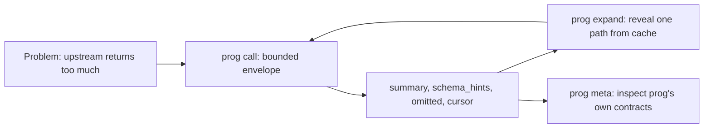

# prog

`prog` is a Rust progressive-disclosure gateway for noisy HTTP APIs, local CLIs, and MCP servers. It keeps model context small by returning bounded envelopes first, then letting you expand only the parts you need from a local cache.

On the current fixture evals, `prog` reduces context by 34.5x-162.8x while keeping envelopes under the 16 KiB invariant.

## Install

Run from the repository root:

```bash
cargo install --path crates/prog-cli
prog --help
```

For development without installing, replace `prog` with `cargo run --`.

## Mental Model



Layer 1, source intelligence: `prog discover` turns a seed or catalog into a `SourceProfile`; `prog hints` summarizes operations, inputs, effects, and suggested next calls.

Layer 2, response intelligence: `prog call` executes one operation and returns a bounded `DisclosureEnvelope`; `prog expand` uses the cursor to reveal a JSON Pointer path from the stored payload without contacting the upstream again.

Layer n+1, reflexivity: `prog meta` exposes `prog`'s own JSON contracts through the same envelope/expand loop.

```bash
prog meta
prog --pretty meta SourceProfile
```

## 5-Minute CLI Quickstart

These commands use the local fixture in `fixtures/cli`. They are copy-pasteable from the repository root after `cargo install --path crates/prog-cli`.

```bash
rm -rf /tmp/prog-demo
prog --dir /tmp/prog-demo --pretty discover demo_cli --kind cli --seed fixtures/cli/seed.json
prog --dir /tmp/prog-demo --pretty call demo_cli list --args '{}'
```

The call returns a bounded envelope. Important fields look like this:

```json
{
  "schema_version": "prog.disclosure.v1",
  "source_id": "demo_cli",
  "operation": "list",
  "summary": {
    "kind": "object",
    "payload_bytes": 17612,
    "approx_tokens": 4403,
    "envelope_bytes": 3437
  },
  "omitted": [
    {
      "path": "/items",
      "reason": "long_array",
      "detail": "30 items, showing 5"
    }
  ],
  "cursor": "pc1_...",
  "cache": {
    "status": "stored",
    "ttl_seconds": 86400
  }
}
```

Copy the cursor automatically and expand only the first three items:

```bash
CURSOR=$(prog --dir /tmp/prog-demo call demo_cli list --args '{}' | python3 -c 'import json,sys; print(json.load(sys.stdin)["cursor"])')
prog --dir /tmp/prog-demo --pretty expand "$CURSOR" --path /items --limit 3 --depth 3
```

Expansion reads the local cache and returns `cache.status: "hit"`. A stale-cache warning tells you to rerun `prog call demo_cli list --refresh` when freshness matters.

Inspect source hints and `prog`'s own source-profile schema:

```bash
prog --dir /tmp/prog-demo --pretty hints demo_cli list
prog --dir /tmp/prog-demo --pretty meta SourceProfile
```

## Token Economics

Token counts use the project heuristic `bytes / 4`, rounded up. Raw cost is the full fixture payload entering context. `prog` cost is the sum of every bounded envelope or expansion stdout consumed for the task.

| Fixture | Task | Raw tokens | prog tokens | Ratio |
|---|---:|---:|---:|---:|
| HTTP | Discover shape | 137883 | 847 | 162.8x |
| HTTP | Count states | 137883 | 3820 | 36.1x |
| HTTP | Target body | 137883 | 1156 | 119.3x |
| CLI | Discover shape | 137753 | 895 | 153.9x |
| CLI | Count states | 137753 | 3917 | 35.2x |
| CLI | Target body | 137753 | 1254 | 109.9x |
| MCP | Discover shape | 137753 | 925 | 148.9x |
| MCP | Count states | 137753 | 3994 | 34.5x |
| MCP | Target body | 137753 | 1319 | 104.4x |

Regenerate the table with:

```bash
PROG_TOKEN_EVAL_UPDATE=1 cargo test -p prog-cli --test eval -- --nocapture
```

See [docs/token-economics.md](docs/token-economics.md) for the checked-in report.

## More Examples

- [End-to-end walkthroughs](docs/walkthroughs.md) for HTTP, CLI, and MCP fixtures.
- [Cache behavior](docs/cache.md), including TTLs, `--refresh`, `--no-cache`, purge behavior, cursor invalidation, staleness warnings, and offline expansion.
- [Safety model](docs/safety.md), including effect flags, fail-closed rules, `--yes`, `trust.allow_shell`, and redaction classes.
- [JSON contracts](docs/contracts.md), generated by `prog meta`.
- [Invariants](INVARIANTS.md) and [RFC 0001](docs/rfcs/0001-progressive-disclosure-gateway.md), [RFC 0002](docs/rfcs/0002-type-theory-formal-methods-and-reflexivity.md), [RFC 0003](docs/rfcs/0003-observation-lenses.md).
- [CHANGELOG](CHANGELOG.md).

## V1 Non-Goals

- No upstream auto-pagination. `prog` can report pagination hints, but it does not fetch additional pages for you.
- No table inference. Output shape inference is JSON-structural, not semantic table detection.
- No MCP server mode. V1 can call MCP servers as an adapter; it does not expose `prog` itself as an MCP server.
- No OpenAPI import yet. HTTP sources use explicit JSON seeds.

## Development Checks

Run these before opening implementation PRs:

```bash
cargo fmt --check
cargo clippy --all-targets -- -D warnings
cargo test
cargo run -- --help
```
